<!-- Artwork in assets/ is generated by scripts/build_assets.py: edit the DATA section there and re-run it. -->


  

  



  



  



  



  


  

<picture>
  <source media="(prefers-color-scheme: dark)" srcset="https://raw.githubusercontent.com/ushan829/ushan829/output/github-snake-dark.svg"/>
  <source media="(prefers-color-scheme: light)" srcset="https://raw.githubusercontent.com/ushan829/ushan829/output/github-snake.svg"/>
  
</picture>

  


<a href="https://ushan829.github.io"></a>

<a href="https://x.com/ushan829"></a>

  


